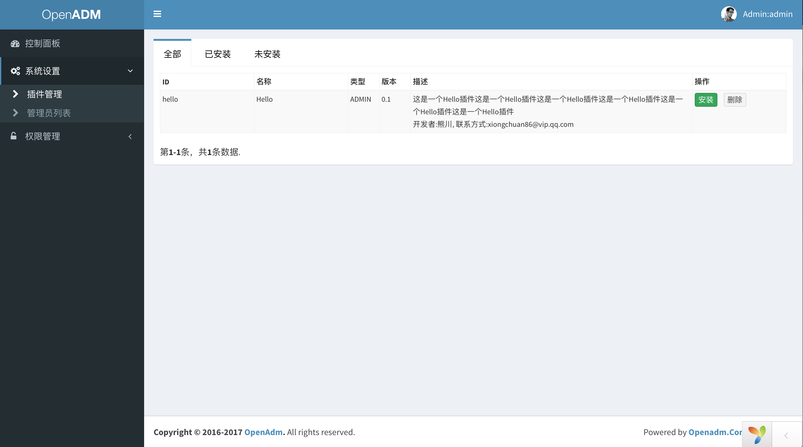
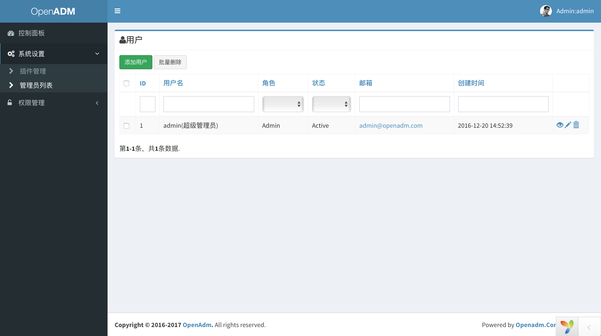
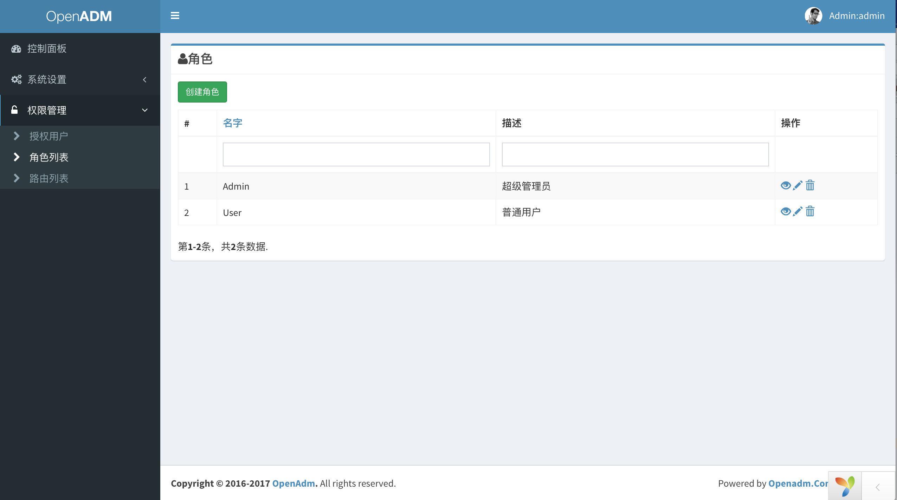
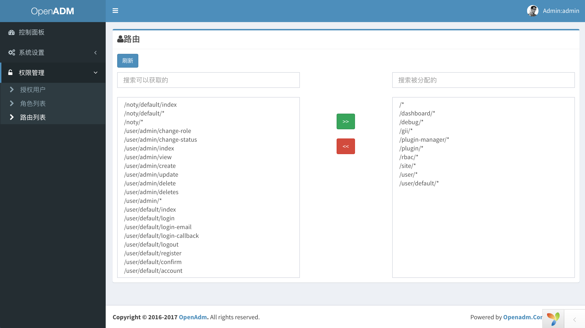

OpenAdm
======
>OpenAdm是一个基于Yii2的后台开源骨架，集成了用户和插件系统,使用主题功能,默认使用AdminLTE2的模板的主题,可以非常方便的开发新的功能。

Demo
----
地址: http://yii2.openadm.com   
后台账号: admin  
后台密码: admin  

仓库地址:
----
>OSC:  
>https://git.oschina.net/xiongchuan86/openadm-yii2.git

>Github:  
>https://github.com/xiongchuan86/openadm-yii2.git  

安装
----
1. git clone https://git.oschina.net/xiongchuan86/openadm-yii2.git
2. composer install #如果是第一次安装yii2,请先执行  
   composer global require "fxp/composer-asset-plugin:^1.2.0"    
3. 创建数据库openadm,如果不使用默认的数据库名,修改environments/dev/app/config/db.php
3. ./init #安装
4. ./yii migrate #数据库初始化
5. 域名admin.yii2.openadm.com指向web目录
6. http://admin.yii2.openadm.com
7. 默认的管理员用户名和密码，admin,admin
8. 如果需要使用前台用户功能,请配置environments/dev/app/config/main-local.php里面的mailer,然后再./init 安装

资源压缩
----
>两套资源打包和压缩的工具,自由随意选择~~    
  
>1. assets.php #是yii默认支持的closure和yui打包和压缩   

>   ./yii asset assets.php app/config/assets-prod.php   
  
>2. assets-gulp.php #gulp方式  

>   cd tools/gulp  

>   npm install -g gulp  #安装全局的gulp命令  

>   npm update  

>   ./yii asset assets-gulp.php app/config/assets-prod.php  

持续集成部署
----
>被部署的服务器需要安装的软件  

1.composer [安装composer](https://getcomposer.org/download/)   
2.github accesstoken 配置,[Github网站生成token](https://github.com/settings/tokens)  
3.git config global github.user xxxx  
4.git config global github.accesstoken xxxx(第二步生成的)  

>使用某个平台(阿里云CRP或者其他)的持续集成。有几个路径:  
1. 部署路径,比如:/path/openadm.com/deploy/ ,持续集成引擎会把代码包(package.tgz)推送到这个目录  
2. 部署后执行脚本:/path/openadm.com/deploy.sh ,当前openadm-yii2下面的deploy.sh,需要提前放到/path/openadm.com/下面。  
3. 此时可以执行部署操作。  
4. deploy工作,主要就是解压deploy/pacage.tgz,放到openadm.com/src/下面  
5. 配置域名到目录的访问:www.openadm.com 指向 /path/openadm.com/src/web/  
6. 低配置的vps或者ecs,composer安装过程可能出现内存不够用,具体查看持续集成引擎的报错,如遇到错误可以参加:[Composer内存错误](https://getcomposer.org/doc/articles/troubleshooting.md#proc-open-fork-failed-errors)  

界面
----

